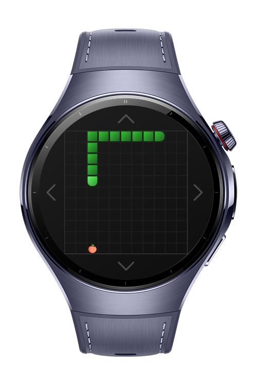
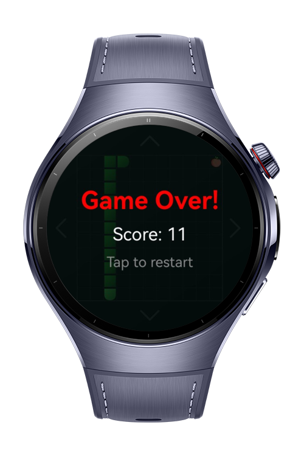

> **Note:** To access all shared projects, get information about environment setup, and view other guides, please visit [Explore-In-HMOS-Wearable Index](https://github.com/Explore-In-HMOS-Wearable/hmos-index).

# Snake

In the Snake game, players control a snake that moves continuously around a grid to eat food items. The goal is to grow
the snake as long as possible by consuming food. Each food item eaten makes the snake longer and increases the score.
The game ends when the snake collides with the walls or its own body.

# Preview

<p align="left">
  
  
</p>

# Use Cases

Quick entertainment during free time with its simple yet addictive gameplay mechanics that keep players engaged.

# Tech Stack

- **Languages**: ArkTS, Typescript
- **Frameworks**: HarmonyOS SDK 5.1.0(18)
- **Tools**: DevEco Studio Vers 5.1.0.842
- **Libraries**: @kit.ArkUI

# Directory Structure

```
entry/src/main/ets/
├───components
│       DirectionButton.ets
│       GameControls.ets
│       GameOver.ets
├───entryability
│       EntryAbility.ets
├───entrybackupability
│       EntryBackupAbility.ets
├───lib
│       Constants.ets
│       Game.ets
│       SnakeRenderer.ets
│       Types.ets
├───pages
│       Index.ets
└───
```

# Constraints and Restrictions

## Supported Devices

- Huawei Watch 5

# LICENSE

Snake is distributed under the terms of the MIT License.
See the [LICENSE](/LICENSE) for more information.